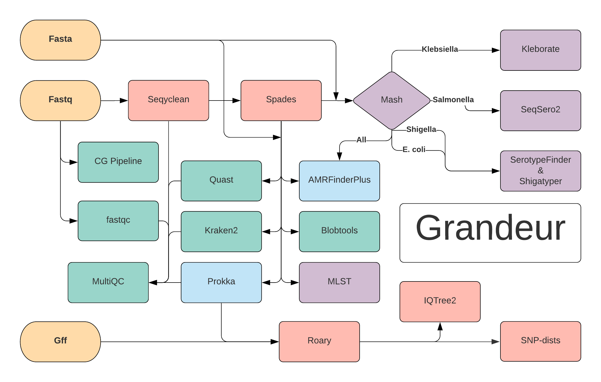

# Grandeur 


Named after the beautiful [Grandeur Peak](https://www.alltrails.com/trail/us/utah/grandeur-peak-east-trail-from-church-fork)

Image Credit: [ryancornia](https://www.roadtripryan.com/go/resources/content/utah/wasatch/grandeur-peak/user-submitted/ryancornia-1505057017043.jpg)

Location:  40.707, -111.76, 8,299 ft (2,421 m) summit

More information about the trail leading up to this landmark can be found at [https://utah.com/hiking/grandeur-peak](https://utah.com/hiking/grandeur-peak)

Grandeur is a [Nextflow](https://www.nextflow.io/) workflow developed by [@erinyoung](https://github.com/erinyoung) at the [Utah Public Health Laborotory](https://uphl.utah.gov/). "Grandeur" is intended to be a species agnostic sequencing analysis workflow to paired-end Illumina sequencing quality control and assurance (QC) and serotyping in a local public health laboratory. "Grandeur" takes paired-end Illumina reads, removes adaptors and PHIX with [seqyclean](https://github.com/ibest/seqyclean), and creates contigs through _de novo_ alignment of the reads with [spades](https://cab.spbu.ru/software/spades/). Then a variety of QC and serotyping tools are employed. This workflow is similar to multiple workflows and tools such as [Cutshaw](https://staph-b.github.io/staphb_toolkit/workflow_docs/cutshaw/), [Dryad](https://staph-b.github.io/staphb_toolkit/workflow_docs/dryad/), [Foushee](https://staph-b.github.io/staphb_toolkit/workflow_docs/foushee/), [Tredegar](https://staph-b.github.io/staphb_toolkit/workflow_docs/tredegar/), [Spriggan](https://github.com/wslh-bio/spriggan), other potential workflows in the [staphB toolkit](https://github.com/StaPH-B/staphb_toolkit), or [Bactopia](https://github.com/bactopia/bactopia), and the authors or maintainers of this workflow will not be offended if an alternative is used. 

"Grandeur" can also take in fastas and [prokka](https://github.com/tseemann/prokka)-annotated gff files to create a phylogenetic tree. Additional fastas includes genomes downloaded from NCBI or contigs generated from another workflow, such as the ones listed above or [Donut Falls](https://github.com/UPHL-BioNGS/Donut_Falls). Fasta files can be serotyped and QCed in the processes that accept fastq files. [Shigatyper](https://github.com/CFSAN-Biostatistics/shigatyper) and [blobtools](https://blobtools.readme.io/docs) require fastq files, so these tools will not run on incoming fasta files. [Mash](https://github.com/marbl/Mash), [seqsero2](https://github.com/denglab/SeqSero2), [quast](http://quast.sourceforge.net/quast), [prokka](https://github.com/tseemann/prokka), [AMRfinderPlus](https://www.ncbi.nlm.nih.gov/pathogens/antimicrobial-resistance/AMRFinder/), [serotypefinder](https://cge.cbs.dtu.dk/services/SerotypeFinder/), [kleboarte](https://github.com/katholt/Kleborate), [kraken2](https://ccb.jhu.edu/software/kraken2/), and [mlst](https://github.com/tseemann/mlst) will work on fastas.

The gff files created via [prokka](https://github.com/tseemann/prokka), are used by [roary](https://sanger-pathogens.github.io/Roary/) to define and align a core genome (a core genome is the genes that all the provided isolates share, also known as a [pan-genome](https://en.wikipedia.org/wiki/Pan-genome)). This multiple sequence alignment is used to create a tree with [iqtree2](http://www.iqtree.org/) and SNP matrix with [snp-dists](https://github.com/tseemann/snp-dists). As this workflow is dependent on the core genome, all of the fasta files put into this portion of the workflow must be the _same species_ (or predicted to have some sort of similar origin, so related plasmids will work as well). [@erinyoung](https://github.com/erinyoung) strongy recommends that the end user checks 'grandeur/roary/summary_statistics.txt' after running to ensure that the number of genes in the core genome makes sense. 

"Grandeur" will also probably be a workflow of the [staphb-toolkit](https://github.com/StaPH-B/staphb_toolkit) once [@erinyoung](https://github.com/erinyoung) gets around to it and all the containers are ready.

# Usage

## Option 1. Running from this github repository
```
# using singularity
nextflow run UPHL-BioNGS/Grandeur -profile singularity
# using docker
nextflow run UPHL-BioNGS/Grandeur -profile docker
```
If just determining relatedness between isolates, there is a 'msa' profile that can be used. This profile suppresses all serotyping on input fasta files.
```
# using singularity
nextflow run UPHL-BioNGS/Grandeur -profile singularity,msa
# using docker
nextflow run UPHL-BioNGS/Grandeur -profile docker,msa
```
## Option 2. Downloading this repository with git and specifying a config file

```
git clone https://github.com/UPHL-BioNGS/Grandeur.git

# using singularity
nextflow run Grandeur.nf -c configs/singularity.config
# using docker
nextflow run Grandeur.nf -c configs/docker.config
```

# Dependencies

- [Nextflow](https://www.nextflow.io/docs/latest/getstarted.html)
- [Singularity](https://singularity.lbl.gov/install-linux) or [Docker](https://docs.docker.com/get-docker/)
- [Git](https://git-scm.com/book/en/v2/Getting-Started-Installing-Git)

# Running Grandeur



## Default file structure
(can be adjusted with 'params.reads', 'params.fastas', and 'params.gff')

### Paired-end fastq.gz (ending with 'fastq', 'fastq.gz', 'fq', or 'fq.gz') reads as follows or designate directory with 'params.reads' or '--reads'
```
directory
└── reads
     └── *fastq.gz
```
WARNING : Sometimes nextflow does not catch every name of paired-end fastq files. This workflow is meant to be fairly agnostic, but if paired-end fastq files are not being found it might be worth renaming them to some sort of 'sample_1.fastq.gz', 'sample_2.fastq.gz' format.

### Fasta files (ending with 'fa', 'fasta', or 'fna') as follows or designate directory with 'params.fastas' or '--fastas'
```
directory
└── fastas
     └── *fasta
```
### Prokka annotated gff files (ending with 'gff') as follows or designate directory with 'params.gff' or '--gff'
```
directory
└── gff
     └── *gff
```

### The directory where the results will be located
A directory will produce files at `'grandeur'` in where the command was inputted, but this can also be adjusted with 'params.outdir' or '--outdir'.

## Example Usage
```
# using singularity
nextflow run UPHL-BioNGS/Grandeur -profile singularity --reads paired --fastas ncbi --gff prior_run --outdir second_attempt
```

This workflow will automatically grab any fastq files in `workflow.launchDir + '/reads'`, fasta files in `workflow.launchDir + '/fastas'`, and gff files in `workflow.launchDir + '/gff'`. This is a feature of the workflow.

# Finding contamination
Additionally, "Grandeur" can use two optional tools to find contamination : [kraken2](https://ccb.jhu.edu/software/kraken2/) or [blobtools](https://blobtools.readme.io/docs) (or both!). These both use large databases that should be downloaded separately. 

## If the **End User** would like to use [kraken2](https://ccb.jhu.edu/software/kraken2/) to identify contamination:

First, there needs to be a kraken2 database. 

```
mkdir kraken2_db
cd kraken2_db
wget ftp://ftp.ccb.jhu.edu/pub/data/kraken2_dbs/old/minikraken2_v2_8GB_201904.tgz
tar -zxvf minikraken2_v2_8GB_201904.tgz
```
This downloads and expands the directory to 'kraken2_db/minikraken2_v2_8GB_201904_UPDATE'.

Then the corresponding params need to be updated.
- `params.kraken2` needs to be set to `true`
  - `params.kraken2 = 'true'`
- `params.kraken2_db` must be set to the directory with the kraken2 database
  - `params.kraken2_db = '<kraken2 database directory>'`
  - `params.kraken2_db = 'kraken2_db/minikraken2_v2_8GB_201904_UPDATE'` in the example

## UNDER DEVELOPMENT : If the End User would like to use [blobtools](https://blobtools.readme.io/docs) to identify contamination:

[Blobtools](https://blobtools.readme.io/docs) uses a blast database, so there needs to be a blast database:

```
mkdir blast_db
cd blast_db
wget "ftp://ftp.ncbi.nlm.nih.gov/blast/db/nt.??.tar.gz"
for file in *tar.gz ; do tar -zxvf $file ; done
```
This downloads NCBI's NT database into 'blast_db'. 
WARNING: The download and decompressing takes a long time. 

- `params.blobtools` needs to be set to `true`
  - `params.blobtools = 'true'`
- `params.blast_db` must be set to the directory with the blast nt database
  - `params.blast_db = '<blast nt database directory'`
  - `params.blast_db = 'blast_db'` in the example

# Suggested inputs

Although not required, [@erinyoung](https://github.com/erinyoung) suggests changing some of the default parameters. 
- Changing the iqtree2 parameters to designate which file should be used as an outgroup
  - `params.outgroup = '<outgroup>'`

<details>
   <summary>Final File Tree after running grandeur.nf</summary>

```
grandeur/
├── aligned
│   ├── sample.sorted.bam
│   └── sample.sorted.bam.csi
├── blastn
│   └── sample.tsv
├── blobtools
│   ├── sample.sample.sorted.bam.cov
│   ├── sample.blobDB.json
│   ├── sample.blobDB.json.bestsum.species.p8.span.100.blobplot.bam0.png
│   ├── sample.blobDB.json.bestsum.species.p8.span.100.blobplot.read_cov.bam0.png
│   ├── sample.blobDB.json.bestsum.species.p8.span.100.blobplot.stats.txt          # Genus and species of the reads
│   └── sample.blobDB.table.txt
├── cg_pipeline
│   ├── sample_cg_pipeline_report.txt                                              # QC metrics of Illumina reads
│   └── cg_pipeline_report.txt
├── contigs
│   └── sample_contigs.fa                                                          # fasta file of contigs
├── fastqc
│   ├── sample_S5_L001_R1_001_fastqc.html
│   ├── sample_S5_L001_R1_001_fastqc.zip
│   ├── sample_S5_L001_R2_001_fastqc.html
│   └── sample_S5_L001_R2_001_fastqc.zip
├── gff
│   └── sample.gff                                                                 # gff file created by prokka
├── grandeur_results.tsv                                                           # summary file
├── iqtree2
│   ├── iqtree.ckp.gz
│   ├── iqtree.contree                       # treefile without node values
│   ├── iqtree.iqtree
│   ├── iqtree.log
│   ├── iqtree.splits.nex
│   └── iqtree.treefile 
├── kleborate
│   ├── sample_results.txt
│   └── kleborate_results.txt                                                      # klebsiella hypervirulence scoring
├── logs
├── mash
│   ├── sample_mashdist.txt                                                        # mash distances
│   └── sample.msh
├── mlst
│   ├── sample_mlst.txt
│   └── mlst_result.tsv                                                            # mlst of organism (if found)
├── ncbi-AMRFinderplus
├── prokka                                                                         # optional, but may save time by pre-generating gff files
│   └── sample
│       ├── sample.err
│       ├── sample.faa
│       ├── sample.ffn
│       ├── sample.fna
│       ├── sample.fsa
│       ├── sample.gbk
│       ├── sample.gff                                                             # annotated contig file that can be used via roary
│       ├── sample.log
│       ├── sample.sqn
│       ├── sample.tbl
│       ├── sample.tsv
│       └── sample.txt
├── quast
│   ├── sample
│   │   ├── basic_stats
│   │   │   ├── cumulative_plot.pdf
│   │   │   ├── GC_content_plot.pdf
│   │   │   ├── sample_GC_content_plot.pdf
│   │   │   └── Nx_plot.pdf
│   │   ├── icarus.html
│   │   ├── icarus_viewers
│   │   │   └── contig_size_viewer.html
│   │   ├── quast.log
│   │   ├── report.html
│   │   ├── report.pdf
│   │   ├── report.tex
│   │   ├── report.tsv
│   │   ├── report.txt
│   │   ├── transposed_report.tex
│   │   ├── transposed_report.tsv
│   │   └── transposed_report.txt
│   └── report.tsv                                                               # QC for contigs
├── roary
│   ├── accessory_binary_genes.fa
│   ├── accessory_binary_genes.fa.newick
│   ├── accessory_graph.dot
│   ├── accessory.header.embl
│   ├── accessory.tab
│   ├── blast_identity_frequency.Rtab
│   ├── clustered_proteins
│   ├── core_accessory_graph.dot
│   ├── core_accessory.header.embl
│   ├── core_accessory.tab
│   ├── core_alignment_header.embl
│   ├── core_gene_alignment.aln              # core genome alignment
│   ├── fixed_input_files
│   │   └── sample.gff
│   ├── gene_presence_absence.csv
│   ├── gene_presence_absence.Rtab
│   ├── number_of_conserved_genes.Rtab
│   ├── number_of_genes_in_pan_genome.Rtab
│   ├── number_of_new_genes.Rtab
│   ├── number_of_unique_genes.Rtab
│   ├── pan_genome_reference.fa
│   └── summary_statistics.txt              # important file with the number of genes involved in core genome
├── seqsero2
│   ├── sample
│   │   ├── sample_H_and_O_and_specific_genes.fasta_mem.fasta
│   │   ├── blasted_output.xml
│   │   ├── data_log.txt
│   │   ├── Extracted_antigen_alleles.fasta
│   │   ├── SeqSero_log.txt
│   │   ├── SeqSero_result.tsv
│   │   └── SeqSero_result.txt
│   └── SeqSero_result.tsv                                                       # Salmonella serotypes
├── seqyclean
│   ├── sample_clean_PE1.fastq.gz                                                # paired-end fastq.gz files after cleaning
│   ├── sample_clean_PE2.fastq.gz
│   ├── sample_clean_SE.fastq.gz
│   ├── sample_clean_SummaryStatistics.tsv
│   ├── sample_clean_SummaryStatistics.txt
│   └── SummaryStatistics.tsv
├── serotypefinder
│   └── sample
│       ├── data.json
│       ├── Hit_in_genome_seq.fsa
│       ├── results_tab.tsv                                                      # E. coli serotypes
│       ├── results.txt
│       ├── Serotype_allele_seq.fsa
│       └── tmp
│           ├── out_H_type.xml
│           └── out_O_type.xml
├── shigatyper
│   └── sample.csv                                                               # Shigatyper serotypes
├── shuffled
│   └── sample_shuffled.fastq.gz
├── spades
│   └── sample
│       ├── assembly_graph_after_simplification.gfa
│       ├── assembly_graph.fastg
│       ├── assembly_graph_with_scaffolds.gfa
│       ├── before_rr.fasta
│       ├── contigs.fasta
│       ├── contigs.paths
│       ├── dataset.info
│       ├── input_dataset.yaml
│       ├── K127
│       │   ├── assembly_graph_after_simplification.gfa
│       │   ├── assembly_graph.fastg
│       │   ├── assembly_graph_with_scaffolds.gfa
│       │   ├── before_rr.fasta
│       │   ├── configs
│       │   │   ├── careful_mda_mode.info
│       │   │   ├── careful_mode.info
│       │   │   ├── config.info
│       │   │   ├── construction.info
│       │   │   ├── detail_info_printer.info
│       │   │   ├── distance_estimation.info
│       │   │   ├── hmm_mode.info
│       │   │   ├── isolate_mode.info
│       │   │   ├── large_genome_mode.info
│       │   │   ├── mda_mode.info
│       │   │   ├── meta_mode.info
│       │   │   ├── metaplasmid_mode.info
│       │   │   ├── metaviral_mode.info
│       │   │   ├── moleculo_mode.info
│       │   │   ├── pe_params.info
│       │   │   ├── plasmid_mode.info
│       │   │   ├── rna_mode.info
│       │   │   ├── rnaviral_mode.info
│       │   │   ├── simplification.info
│       │   │   ├── toy.info
│       │   │   └── tsa.info
│       │   ├── final_contigs.fasta
│       │   ├── final_contigs.paths
│       │   ├── final.lib_data
│       │   ├── path_extend
│       │   ├── scaffolds.fasta
│       │   └── scaffolds.paths
│       ├── K21
│       │   ├── configs
│       │   │   ├── careful_mda_mode.info
│       │   │   ├── careful_mode.info
│       │   │   ├── config.info
│       │   │   ├── construction.info
│       │   │   ├── detail_info_printer.info
│       │   │   ├── distance_estimation.info
│       │   │   ├── hmm_mode.info
│       │   │   ├── isolate_mode.info
│       │   │   ├── large_genome_mode.info
│       │   │   ├── mda_mode.info
│       │   │   ├── meta_mode.info
│       │   │   ├── metaplasmid_mode.info
│       │   │   ├── metaviral_mode.info
│       │   │   ├── moleculo_mode.info
│       │   │   ├── pe_params.info
│       │   │   ├── plasmid_mode.info
│       │   │   ├── rna_mode.info
│       │   │   ├── rnaviral_mode.info
│       │   │   ├── simplification.info
│       │   │   ├── toy.info
│       │   │   └── tsa.info
│       │   ├── final.lib_data
│       │   └── simplified_contigs
│       │       ├── contigs_info
│       │       ├── contigs.off
│       │       └── contigs.seq
│       ├── K33
│       │   ├── configs
│       │   │   ├── careful_mda_mode.info
│       │   │   ├── careful_mode.info
│       │   │   ├── config.info
│       │   │   ├── construction.info
│       │   │   ├── detail_info_printer.info
│       │   │   ├── distance_estimation.info
│       │   │   ├── hmm_mode.info
│       │   │   ├── isolate_mode.info
│       │   │   ├── large_genome_mode.info
│       │   │   ├── mda_mode.info
│       │   │   ├── meta_mode.info
│       │   │   ├── metaplasmid_mode.info
│       │   │   ├── metaviral_mode.info
│       │   │   ├── moleculo_mode.info
│       │   │   ├── pe_params.info
│       │   │   ├── plasmid_mode.info
│       │   │   ├── rna_mode.info
│       │   │   ├── rnaviral_mode.info
│       │   │   ├── simplification.info
│       │   │   ├── toy.info
│       │   │   └── tsa.info
│       │   ├── final.lib_data
│       │   └── simplified_contigs
│       │       ├── contigs_info
│       │       ├── contigs.off
│       │       └── contigs.seq
│       ├── K55
│       │   ├── configs
│       │   │   ├── careful_mda_mode.info
│       │   │   ├── careful_mode.info
│       │   │   ├── config.info
│       │   │   ├── construction.info
│       │   │   ├── detail_info_printer.info
│       │   │   ├── distance_estimation.info
│       │   │   ├── hmm_mode.info
│       │   │   ├── isolate_mode.info
│       │   │   ├── large_genome_mode.info
│       │   │   ├── mda_mode.info
│       │   │   ├── meta_mode.info
│       │   │   ├── metaplasmid_mode.info
│       │   │   ├── metaviral_mode.info
│       │   │   ├── moleculo_mode.info
│       │   │   ├── pe_params.info
│       │   │   ├── plasmid_mode.info
│       │   │   ├── rna_mode.info
│       │   │   ├── rnaviral_mode.info
│       │   │   ├── simplification.info
│       │   │   ├── toy.info
│       │   │   └── tsa.info
│       │   ├── final.lib_data
│       │   └── simplified_contigs
│       │       ├── contigs_info
│       │       ├── contigs.off
│       │       └── contigs.seq
│       ├── K77
│       │   ├── configs
│       │   │   ├── careful_mda_mode.info
│       │   │   ├── careful_mode.info
│       │   │   ├── config.info
│       │   │   ├── construction.info
│       │   │   ├── detail_info_printer.info
│       │   │   ├── distance_estimation.info
│       │   │   ├── hmm_mode.info
│       │   │   ├── isolate_mode.info
│       │   │   ├── large_genome_mode.info
│       │   │   ├── mda_mode.info
│       │   │   ├── meta_mode.info
│       │   │   ├── metaplasmid_mode.info
│       │   │   ├── metaviral_mode.info
│       │   │   ├── moleculo_mode.info
│       │   │   ├── pe_params.info
│       │   │   ├── plasmid_mode.info
│       │   │   ├── rna_mode.info
│       │   │   ├── rnaviral_mode.info
│       │   │   ├── simplification.info
│       │   │   ├── toy.info
│       │   │   └── tsa.info
│       │   ├── final.lib_data
│       │   └── simplified_contigs
│       │       ├── contigs_info
│       │       ├── contigs.off
│       │       └── contigs.seq
│       ├── K99
│       │   ├── configs
│       │   │   ├── careful_mda_mode.info
│       │   │   ├── careful_mode.info
│       │   │   ├── config.info
│       │   │   ├── construction.info
│       │   │   ├── detail_info_printer.info
│       │   │   ├── distance_estimation.info
│       │   │   ├── hmm_mode.info
│       │   │   ├── isolate_mode.info
│       │   │   ├── large_genome_mode.info
│       │   │   ├── mda_mode.info
│       │   │   ├── meta_mode.info
│       │   │   ├── metaplasmid_mode.info
│       │   │   ├── metaviral_mode.info
│       │   │   ├── moleculo_mode.info
│       │   │   ├── pe_params.info
│       │   │   ├── plasmid_mode.info
│       │   │   ├── rna_mode.info
│       │   │   ├── rnaviral_mode.info
│       │   │   ├── simplification.info
│       │   │   ├── toy.info
│       │   │   └── tsa.info
│       │   ├── final.lib_data
│       │   └── simplified_contigs
│       │       ├── contigs_info
│       │       ├── contigs.off
│       │       └── contigs.seq
│       ├── misc
│       │   └── broken_scaffolds.fasta
│       ├── params.txt
│       ├── pipeline_state
│       │   ├── stage_0_before_start
│       │   ├── stage_10_bs
│       │   ├── stage_11_terminate
│       │   ├── stage_1_as_start
│       │   ├── stage_2_k21
│       │   ├── stage_3_k33
│       │   ├── stage_4_k55
│       │   ├── stage_5_k77
│       │   ├── stage_6_k99
│       │   ├── stage_7_k127
│       │   ├── stage_8_copy_files
│       │   └── stage_9_as_finish
│       ├── run_spades.sh
│       ├── run_spades.yaml
│       ├── scaffolds.fasta
│       ├── scaffolds.paths
│       ├── spades.log
│       └── tmp
├── snp_dists
│   └── snp_matrix.txt                      # SNP matrix counting the number of SNPs that each sample differs by
└── summary
    ├── sample.summary.tsv
    ├── sample.summary.txt
    └── grandeur_summary.txt                                                    # a table with a summary from all the serotyping and QC tools
```
</details>
   


# Visualizing the tree

It'd be nice if a tree was automatically generated from this. Really nice. It has been difficult to find a container that creates a high-quality tree in a command line interface that automatically resizes the text and tree appropriately. (Although, we're always open to suggestions!) The phylogenetic tree found at 'grandeur/iqtree2/iqtree.treefile' or 'grandeur/iqtree2/iqtree.contree' can be visualized through multiple tools, such as [ggtree](https://yulab-smu.top/treedata-book/) or [ete3](http://etetoolkit.org/treeview/).  

# Grandeur wouldn't be possible without:

- [seqyclean](https://github.com/ibest/seqyclean) - cleaning reads
- [spades](https://cab.spbu.ru/software/spades/) - _de novo_ alignment
- [prokka](https://github.com/tseemann/prokka) - gene annotation - used in peak, optionally in grandeur
- [roary](https://sanger-pathogens.github.io/Roary/) - core genome alignment - only used in peak
- [iqtree2](http://www.iqtree.org/) - phylogenetic tree creation - only used in peak
- [snp-dists](https://github.com/tseemann/snp-dists) - SNP matrix - only used in peak
- [mash](https://github.com/marbl/Mash) - species identifier
- [fastqc](https://github.com/s-andrews/FastQC) - fastq file QC
- [quast](http://quast.sourceforge.net/quast) - contig QC
- [cg-pipeline](https://github.com/lskatz/lyve-SET) - fastq file QC
- [multiqc](https://multiqc.info/) - summarizes QC efforts
- [seqsero2](https://github.com/denglab/SeqSero2) - Salmonella serotyping
- [shigatyper](https://github.com/CFSAN-Biostatistics/shigatyper) - Shigella serotyping
- [kleborate](https://github.com/katholt/Kleborate) - Klebsiella serotyping
- [serotypefinder](https://cge.cbs.dtu.dk/services/SerotypeFinder/) - E. coli serotyping
- [mlst](https://github.com/tseemann/mlst) - identification of MLST subtype
- [ncbi-amrfinderplus](https://www.ncbi.nlm.nih.gov/pathogens/antimicrobial-resistance/AMRFinder/) - identification of genes associated with antimicrobial resistence
- [blobtools](https://blobtools.readme.io/docs) - contamination
- [kraken2](https://ccb.jhu.edu/software/kraken2/) - contamination
- [blastn](https://www.ncbi.nlm.nih.gov/books/NBK279684/) - read identification with blobtools
- [bwa](http://bio-bwa.sourceforge.net/) - alignment for blobtools
- [samtools](https://github.com/samtools) - sorting and bam creation for blobtools

# Frequently Asked Questions (aka FAQ)
## What do I do if I encounter an error?

**TELL ME ABOUT IT!!!**
* [Github issue](https://github.com/UPHL-BioNGS/Grandeur/issues)
* [Email me](eriny@utah.gov)
* Send me a message on slack

Be sure to include the command used, what config file was used, and what the **nextflow** error was. 

## Where is an example config file?
There is a template file with all the variables in this repo at [configs/grandeur_template.config](./configs/grandeur_template.config) that the **End User** can copy and edit. All of the parameters are included in that file.

There's also a config file what we use here at UPHL, [UPHL.config](./configs/UPHL.config).

## Do you have test data?
Yes, actually, but also not quite. Fastq files can be rather large and github is not the best place to store them. Instead, some sample fastq files from the [SRA](https://www.ncbi.nlm.nih.gov/sra) have gone through the "Grandeur" workflow and the results are included in this repo for your comparison.

- [SRR11725329](https://www.ncbi.nlm.nih.gov/sra/?term=SRR11725329) : _Escherichia coli_
- [SRR13643280](https://www.ncbi.nlm.nih.gov/sra/?term=SRR13643280) : _Acinetobacter baumannii_
- [SRR14436834](https://www.ncbi.nlm.nih.gov/sra/?term=SRR14436834) : _Stenotrophomonas maltophilia_
- [SRR14634837](https://www.ncbi.nlm.nih.gov/sra/?term=SRR14634837) : _Klebsiella pneumoniae_
- [SRR7738178](https://www.ncbi.nlm.nih.gov/sra/?term=SRR7738178) : _Shigella sonnei_ 
- [SRR7889058](https://www.ncbi.nlm.nih.gov/sra/?term=SRR7889058) : _Salmonella enterica_

These can be downloaded using [fasterq-dump](https://github.com/ncbi/sra-tools/wiki/HowTo:-fasterq-dump) (part of the [SRA](https://github.com/ncbi/sra-tools) toolkit) as follows:
```
for sra in SRR11725329 SRR13643280 SRR14436834 SRR14634837 SRR7738178 SRR7889058
do
   fasterq-dump -A $sra --split-files --outdir reads
done 
```

There are also 6 genomes from NCBI genome that are in this repository under data/fasta:
- [GCF_000005845.2_ASM584v2](https://www.ncbi.nlm.nih.gov/assembly/GCF_000005845.2/) : _Escherichia coli_
- [GCF_000006925.2_ASM692v2](https://www.ncbi.nlm.nih.gov/assembly/GCF_000006925.2/) : _Shigella flexneri_
- [GCF_000006945.2_ASM694v2](https://www.ncbi.nlm.nih.gov/assembly/GCF_000006945.2/) : _Salmonella enterica_
- [GCF_000240185.1_ASM24018v2](https://www.ncbi.nlm.nih.gov/assembly/GCF_000240185.1/) : _Klebsiella pneumoniae_
- [GCF_008632635.1_ASM863263v1](https://www.ncbi.nlm.nih.gov/assembly/GCF_008632635.1/) : _Acinetobacter baumannii_
- [GCF_900475405.1_44087_C01](https://www.ncbi.nlm.nih.gov/assembly/GCF_900475405.1/) : _Stenotrophomonas maltophilia_

And then run with
```
nextflow run UPHL-BioNGS/Grandeur -profile singularity --reads reads --fastas data/fasta
```

Summary files from running these through the default workflow ([grandeur_results.tsv](./data/grandeur_results.tsv)) as well as with UPHL's config file ([UPHL_grandeur_results.tsv](./data/UPHL_grandeur_results.tsv)) are also available.

The directory `data/msa` contains one gff file and 6 fasta files of _Stenotrophomonas maltophilia_ that can be used to test multiple sequence alignment. A resulting treefile ([iqtree.treefile](./data/msa/iqtree.treefile)), snp_matrix ([snp_matrix.txt](./data/msa/snp_matrix.txt)), and roary summary file ([summary_statistics.txt](./data/msa/summary_statistics.txt)) are included for comparison. 

Testing creating a phylogenetic tree from a core gene comparison:
```
nextflow run UPHL-BioNGS/Grandeur -profile singularity,msa --fastas data/msa --gff data/msa 
# or
nextflow run UPHL-BioNGS/Grandeur -profile singularity,msa --fastas data/msa --gff data/msa --outgroup GCF_900475405.1_44087_C01_genomic
```

## How do I turn processes off?

Most of the processes in this workflow can be turned off. To turn a process off, change it's associated parameter to false (i.e. `'params.shigatyper = false'`).

The following toggles are available and their default values are listed here:

```
params.amrfinderplus = true
// right now blobtools at the blastn process is not working
params.blobtools = false 
params.cg_pipeline = true
params.fastqc = true
// will only run on Klebsiella
params.kleborate = true
// WARNING : if kraken2 is toggled to true, the end user must specify the location of the kraken2 database
params.kraken2 = false
// WARNING : mash is used to guess which organism is being sequenced. Thus seqsero2, kleborate, serotypefinder, and shigatyper are connected to mash.
params.mash = true
params.mlst = true
params.multiqc = true
// default is set to false because most runs have multiple species per run. Change to true if determining relatedness.
params.prokka = false
params.quast = true
params.roary = true
// will only run on Salmonella
params.seqsero2 = true
// will only run on E. coli and Shigella
params.serotypefinder = true
// will only run on E. coli and Shigella
params.shigatyper = true
// WARNING : spades is required to generate fasta files of resulting contigs and will turn off all downstream processes
params.spades = true
// set to true for core genome alignment
params.roary = false
// for getting a kraken database into roary for qc. If set to 'true' the end user must specify the location of the kraken database
params.kraken = false
params.iqtree2 = true
params.snp_dists = true
```

## What about CLIA validation?

At UPHL, we use this workflow to determine the serotype of Salmonella and E. coli under CLIA. Therefore, if you look at [our config file](./configs/UPHL.config), we explicitly specify the containers used for Salmonella serotyping with [seqsero2](https://github.com/denglab/SeqSero2), as well as E. coli serotyping with [serotypefinder](https://cge.cbs.dtu.dk/services/SerotypeFinder/) and [shigatyper](https://github.com/CFSAN-Biostatistics/shigatyper). We also specify the containers used prior to these processes in the workflow : [seqyclean](https://github.com/ibest/seqyclean) and [spades](https://cab.spbu.ru/software/spades/) (which isn't used for [seqsero2](https://github.com/denglab/SeqSero2) or [shigatyper](https://github.com/CFSAN-Biostatistics/shigatyper), but it is used for [serotypefinder](https://cge.cbs.dtu.dk/services/SerotypeFinder/)). 

The CLIA officer of the **End User** may request additional locks be put in place, like having all of the containers specified. If additional help is needed, please [submit an issue](https://github.com/UPHL-BioNGS/Grandeur/issues) or [Email me](eriny@utah.gov).

## How were serotyping tools chosen for this workflow?
They perform _well_, their containers were easy to create, and [@erinyoung](https://github.com/erinyoung) had heard about them.

## Are any other tools getting added to "Grandeur"?

As "Grandeur" is intended to be a species agnostic workflow for a local public health laboratory, and sequencing is continuing to expand in its utility, new tools are constantly being needed to analyze isolates to further public health goals. 

For example, the _C. auris_ worfklow [mycosnp](https://github.com/CDCgov/mycosnp) is missing from this workflow, as is any sort of plasmid analysis. 

Many of these additional tools are added by need locally or from the **End User**, so if the **End User** knows of other serotyping/analysis tools, please [submit an issue](https://github.com/UPHL-BioNGS/Grandeur/issues) or tell [@erinyoung](https://github.com/erinyoung) about it, and we'll work in some options. 

[@erinyoung](https://github.com/erinyoung) also appreciates pull requests from forks.

**Warning** : If there's not a relaible container of the suggested tool, [@erinyoung](https://github.com/erinyoung) will request that the **End User** create a container for that tool and contribute to [StaPH-B's docker repositories](https://github.com/StaPH-B/docker-builds).

## What about organisms with large genomes?
Organisms with large genomes can still contribute to disease, but this is not the workflow for those. "Grandeur" uses [spades](https://cab.spbu.ru/software/spades/). Large genomes may be too much for [spades](https://cab.spbu.ru/software/spades/). 

## What about SARS-CoV-2?
As of the time of writing this README, reference-based alignment of SARS-CoV-2 is still the norm. "Grandeur" is for _de novo_ assembly of things with small genome. [Cecret](https://github.com/UPHL-BioNGS/Cecret) would be a better workflow for SARS-CoV-2 sequencing. 

## What is genome_sizes.json used for?
[genome_sizes.json](./configs/genome_sizes.json) has a list of commonly sequenced organisms and the approximate expected genome size for each organism. This is only used for the "cg-pipeline" process to estimate coverage. A file from the **End User** can be used instead and specified with `params.genome_sizes`. 

## How do I cite this workflow?

This workflow stands on the shoulders of giants. As such, please cite the individual tools that were useful for your manuscript so that those developers can continue to get funding. They are listed above. Mentioning this workflow in the text as "The Grandeur workflow v.VERSION (www.github.com/UPHL-BioNGS/Grandeur)" is good enough for [@erinyoung](https://github.com/erinyoung)'s ego.

## Why does the default [shigatyper](https://hub.docker.com/r/andrewlangvt/shigatyper) container not work with nextflow's `-with-tower` option?

There is actually hope that this will eventually be remedied, but for now the default shigatyper container does not contain 'ps', so it will not work with nextflow tower. 

## Can I use roary's QC options with kraken?

No. If there is interest in this feature, please contribute to the conversation at [StaPH-B/docker-builds](https://github.com/StaPH-B/docker-builds/issues/254).


